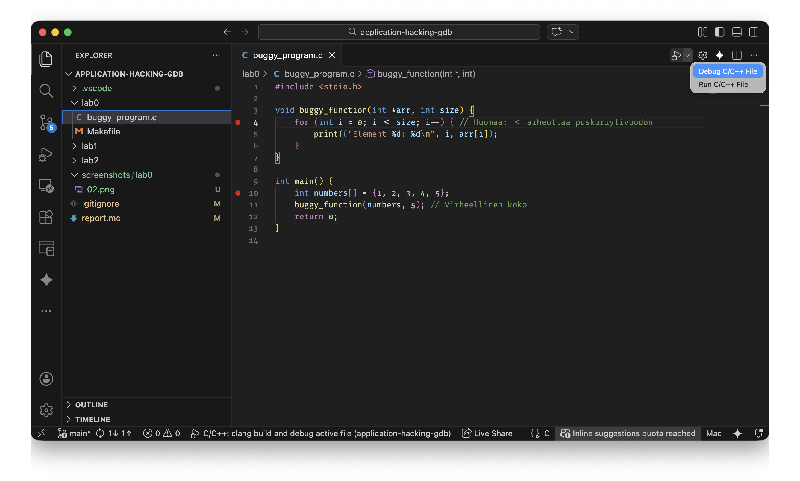
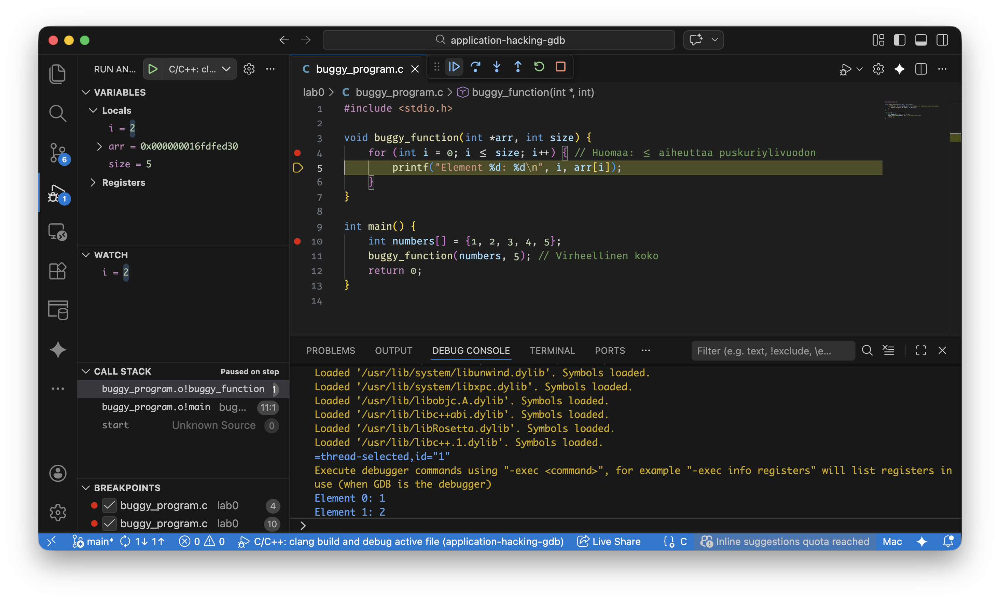
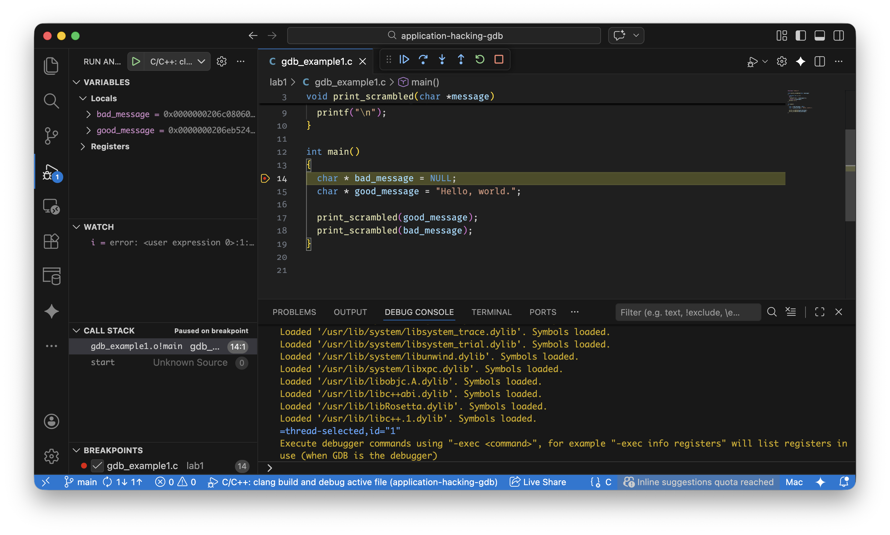
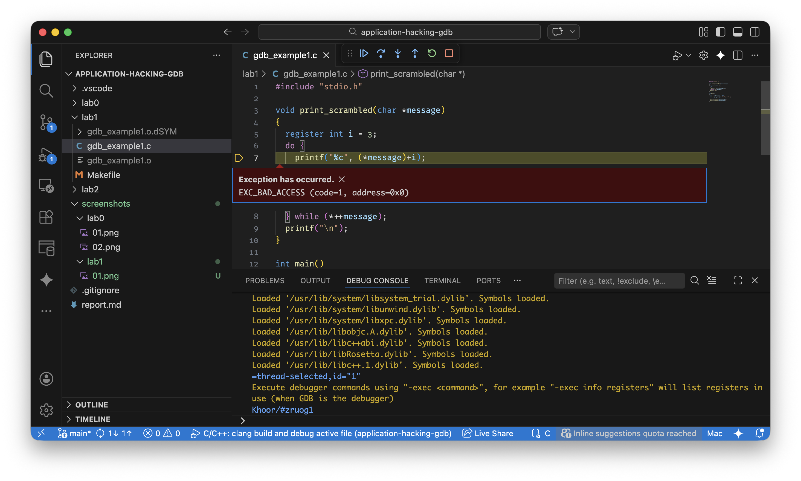
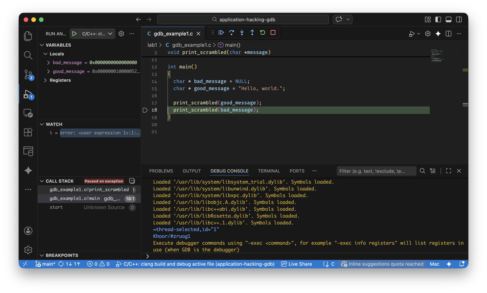
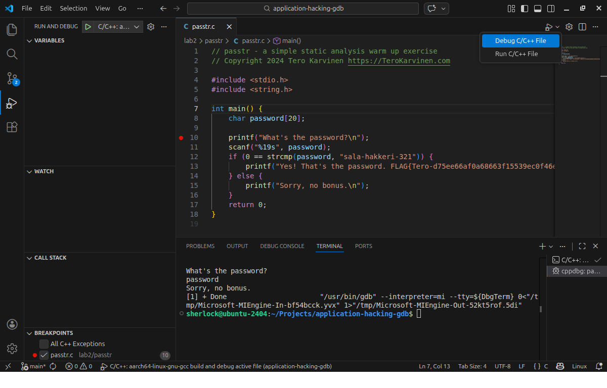
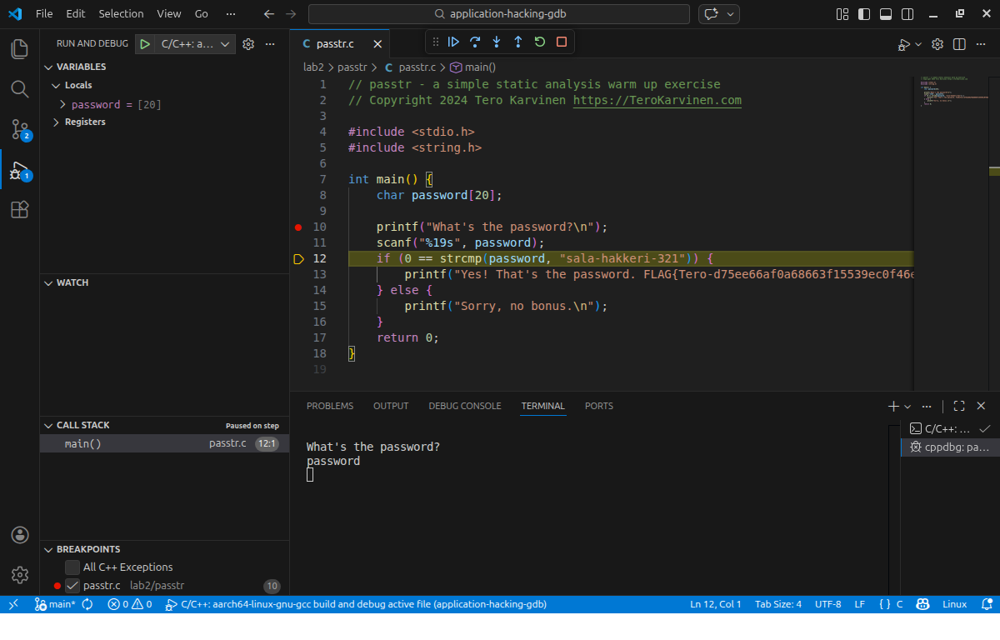
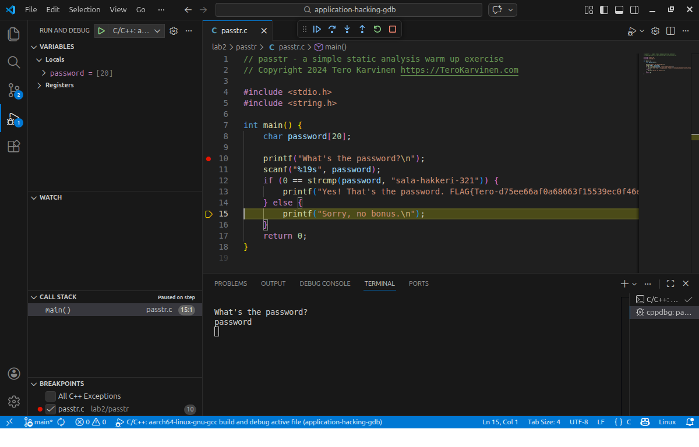
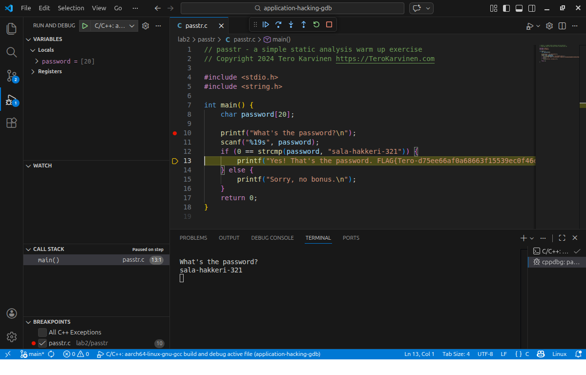

# GNU Debugger and friends!

Aha! Debugger, a close friend of every developer in the world. You may argue that you don't need to know how to use a debugger to write code. Yes, it's true. But I'll tell you that, if you can have a successful program from the very start&mdash;when you write the first line of code&mdash;to the very end&mdash;when you leave your desk with all your desireable outcomes fulfilled, without using any kind of at least one debugging tool or technique, I can say that, you must be a genius&mdash;or, you are not a developer, yet. Linus Torvalds wrote in his reply to a forum thread, *"I don't like debuggers. Never have, probably never will."* (LLKM 2000)&mdash;definitely he's a genius, no doubt about it. But he also said, *"I use gdb all the time, but I tend to use it not as a debugger, but as a disassembler on steroids that you can program."*&mdash;honestly I don't fully get his point when saying this, but one thing I can understand from his words, a genius always has his own way of thinking. 

Debugging is, for sure, one of the most important aspects of software development process. Beyond simply fixing errors, it is a journey into the inner workings of a system. In addition to traditional debugging techniques such as printing logs, by using tools like GDB, developers can pause execution, inspect memory, and understand exactly how their logic translates into machine instructions. Mastering these tools transforms the act of coding from a guessing game into a precise science. And in the context of security and application hacking, the debugger becomes even more powerful: it is the lens through which we reverse engineer binaries and identify vulnerabilities that are invisible to the naked eye.

I have many years of experience as a software developer and I really understand the importance of debugging. But, hold on! This is 21st century, right? Why we still have to use bare GDB, even with text-based user interface (TUI), while we can use modern integrated development environments (IDEs), which has a graphical user interface (GUI) instead? You may ask me: what are the benefits of using GUI based IDEs? At least I can tell you: I don't have to print a copy of cheat sheet and bring it along to my workplace or pin it onto my desktop, so that I can look up every command I need to use while debugging. Yes, believe me! I don't have to memorize anything, because it's just a matter of lifting my finger and clicking on a right button. My brain has more free space and time to address the problem I'm dealing with. 

> *“I consider that a man's brain originally is like a little empty attic, and you have to stock it with such furniture as you choose. A fool takes in all the lumber of every sort that he comes across, so that the knowledge which might be useful to him gets crowded out, or at best is jumbled up with a lot of other things, so that he has a difficulty in laying his hands upon it. Now the skillful workman is very careful indeed as to what he takes into his brain-attic. He will have nothing but the tools which may help him in doing his work, but of these he has a large assortment, and all in the most perfect order. It is a mistake to think that that little room has elastic walls and can distend to any extent. Depend upon it there comes a time when for every addition of knowledge you forget something that you knew before. It is of the highest importance, therefore, not to have useless facts elbowing out the useful ones.”*&mdash;Arthur Conan Doyle, A Study in Scarlet

That's why I will use [Visual Studio Code](https://code.visualstudio.com/)&mdash;the most popular, free and open source IDE in the world, and [C/C++ Extension Pack](https://marketplace.visualstudio.com/items?itemName=ms-vscode.cpptools-extension-pack) throughout these assignments of mine. For more information, see [Configure C/C++ debugging](https://code.visualstudio.com/docs/cpp/launch-json-reference).

## lab0

Here are some screenshots while debugging. 

- Start debugging

- Investigate variables using locals, globals, and watches

## lab1

Here are some screenshots while debugging. 

- Start debugging

- Error happens

- Trace the stack to see which parameter causes the error

## lab2

Here are some screenshots while debugging.

- Start debugging

- After user input, the execution flow stops immediately at the next line of code

- When user enters a wrong password

- When user enters the valid password

Note: Apple has not supported quite well for LLDB so I have to switch to Ubuntu on a virtual machine to continue on this assignment. 

## Sources

- LKML 2000. LKML: Linus Torvalds: Re: Availability of kdb. 6 September 2ooo. URL: https://lkml.org/lkml/2000/9/6/65. Accessed: 28 February 2026
